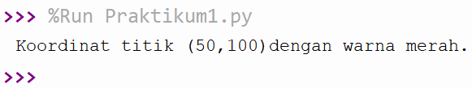
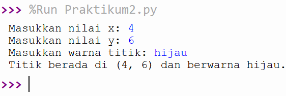
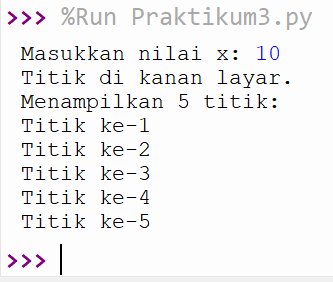
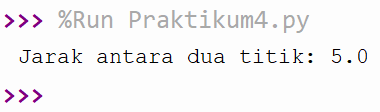
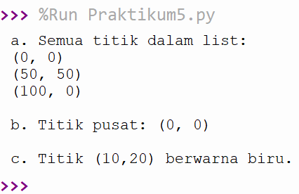

# Praktikum Pertemuan 1
## Soal 1: Variabel
Kode: [Praktikum1.py](Praktikum1.py)

## Soal 2: Input dan Output
Kode: [Praktikum2.py](Praktikum2.py)

## Soal 3: Struktur Kontrol
Kode: [Praktikum3.py](Praktikum3.py)

## Soal 4: Fungsi
Kode: [Praktikum4.py](Praktikum4.py)

## Soal 5: List, Tuple, dan Dictionary
Kode: [Praktikum5.py](Praktikum5.py)

